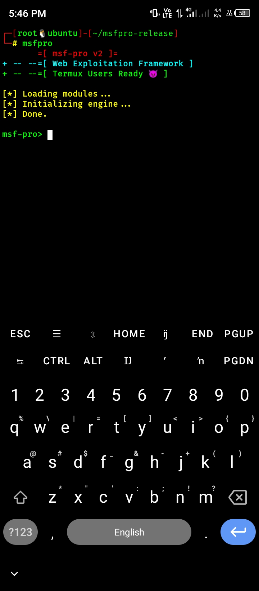

# 🔥 msfpro - Web Exploitation Framework

# msfpro 🔥

> Lightweight Web Exploitation Framework for Bug Bounty Hunters

---

## 🚀 Features

- 🔍 IDOR scanning
- 💥 XSS detection
- 🧠 SQL Injection testing
- 📂 LFI / SSRF detection
- ⚡ Smart scanning engine
- 💻 Interactive CLI (Metasploit-style)

---

## ⚙️ Installation

git clone https://github.com/sangammunda40-collab/msfpro.git
cd msfpro
clang main.c core/http.c modules/*.c -lcurl -lpthread -o msfpro

---

## 💻 Usage

./msfpro

### Example

use idor
set TARGET https://example.com/api/user
run

---

## 📁 Modules

idor   - IDOR brute force  
xss    - XSS detection  
sqli   - SQL injection  
lfi    - Local file inclusion  
ssrf   - SSRF detection  

---

## ⚠️ Disclaimer

This tool is for educational and authorized testing only.

---

## ⭐ Support

If you like this project, give it a ⭐ on GitHub!

## 📸 Demo

> Coming soon...

## 📸 Screenshots

### 🟢 Modules View

### 🔵 Scan Output

