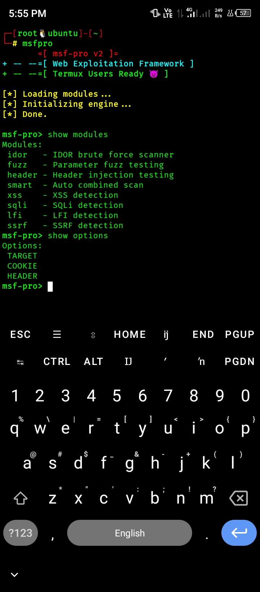
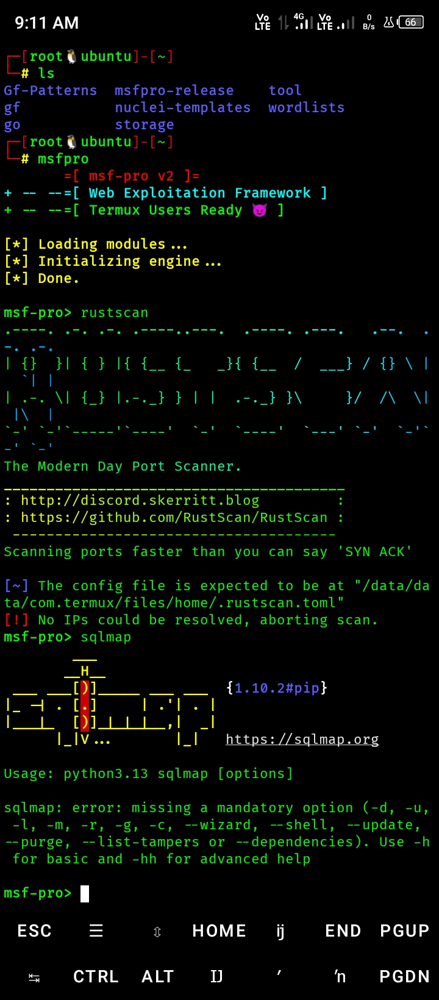

# 🔥 msfpro - Web Exploitation Framework

> ⚡ Lightweight Web Exploitation Framework for Bug Bounty Hunters (Termux Friendly)

---

## 🚀 Features

- 🔍 IDOR scanning  
- 💥 XSS detection  
- 🧠 SQL Injection testing  
- 📂 LFI / SSRF detection  
- ⚡ Smart scanning engine  
- 📱 Optimized for Termux  

---

## ⚙️ Installation

git clone https://github.com/sangammunda40-collab/msfpro.git  
cd msfpro  
clang main.c core/http.c modules/*.c -lcurl -lpthread -o msfpro  

---

## 💻 Usage

./msfpro  

---

## 📁 Modules

idor   - IDOR brute force  
xss    - XSS detection  
sqli   - SQL injection  
lfi    - Local file inclusion  
ssrf   - SSRF detection  

---

## 📸 Screenshots

### 🧠 Console View

### 🧩 Modules View

---

## ⚡ Tool Interaction (Live Usage)

### 💉 SQLMap + 🔍 RustScan Integration  
Fast port discovery using RustScan + SQLMap testing  

---

## ⚠️ Disclaimer

For educational and authorized testing only.

---

## ⭐ Support

Give a ⭐ if you like this project!
